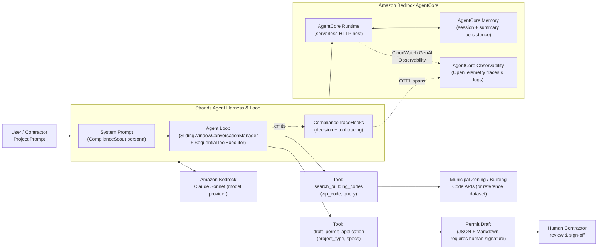

# ComplianceScout

**Agents for Humans Hackathon — Professional Agents Track**

An autonomous Pro Agent that takes a contractor's plain-language project
description, checks it against local building codes, drafts the permit
paperwork, and flags compliance blockers — pinging a human only when a
signature or judgment call is actually required.

---

## The Problem

Small-scale contractors — the people actually doing the physical work —
lose **10+ hours a week** buried in municipal paperwork: chasing down
which permits apply, cross-referencing local zoning and building codes,
and manually filling out forms before they can even pick up a tool.
That's a full workday, every week, spent on bureaucracy instead of on
the job site.

## Who It's For

- Independent home builders
- Licensed electricians
- Small general contracting crews and solo tradespeople

People who don't have a back-office compliance team, and whose time is
worth far more on a roof or in a panel box than in a PDF form.

## Why It Matters

Every hour ComplianceScout saves on code research and paperwork drafting
is an hour of skilled human capital returned to actual construction. It
doesn't replace the contractor's judgment or their license — it removes
the grunt work that sits between "I know how to build this" and "I'm
legally allowed to start."

---

## Architecture

ComplianceScout is a [Strands Agents](https://strandsagents.com) agent
backed by **Amazon Bedrock (Claude Sonnet)**, running two custom tools for
code lookup and permit drafting, deployed serverlessly on **Amazon
Bedrock AgentCore Runtime** with AgentCore Memory for session persistence
and AgentCore Observability (OpenTelemetry) for full decision tracing.



**Key design decisions:**

- **Autonomous but bounded** — the agent researches codes and drafts
  paperwork on its own initiative, but a `requires_signature: true` flag
  on every permit draft, plus explicit escalation instructions in the
  system prompt, ensure a human always reviews before anything is filed.
- **Traceable by construction** — `agent/hooks.py` registers a
  `ComplianceTraceHooks` provider on Strands' hook system, logging and
  emitting OpenTelemetry spans for every model invocation and tool call
  (arguments, latency, status). Tool execution is forced sequential via
  `SequentialToolExecutor` so the trace stays easy for a human auditor to
  follow.
- **Bounded conversation growth** — `SlidingWindowConversationManager`
  caps how much conversation history feeds back into the model per turn.
- **Deploy-anywhere** — the same `Agent` object runs via the local CLI
  runner, in a plain Docker container, or behind Amazon Bedrock AgentCore
  Runtime with zero code branching (`agent/compliance_agent.py` detects
  whether the `bedrock_agentcore` SDK is available and only wires the
  serverless entrypoint when it is).

### Project Structure

```
contractor-compliance-scout/
├── agent/
│   ├── compliance_agent.py   # Agent wiring, model config, AgentCore entrypoint, CLI runner
│   ├── hooks.py              # ComplianceTraceHooks (tracing/logging/OTEL)
│   ├── prompts.py            # ComplianceScout system prompt
│   └── __init__.py
├── tools/
│   ├── compliance_tools.py   # search_building_codes, draft_permit_application
│   └── __init__.py
├── tests/
│   ├── test_compliance_tools.py
│   └── __init__.py
├── scripts/
│   └── setup_agentcore.sh    # Wraps the `agentcore` CLI using agentcore.json
├── agentcore.json            # Declarative AgentCore deployment configuration
├── Dockerfile
├── requirements.txt
├── .env.example
└── README.md
```

---

## Local Setup

### 1. Prerequisites

- Python 3.10+
- An AWS account with access to **Amazon Bedrock** and the Claude Sonnet
  model enabled in your region
- AWS credentials configured (`aws configure`, or exported env vars)

### 2. Install dependencies

```bash
python3 -m venv .venv
source .venv/bin/activate        # Windows: .venv\Scripts\activate
pip install -r requirements.txt
```

### 3. Configure environment variables

```bash
cp .env.example .env
```

| Variable | Description |
|---|---|
| `AWS_REGION` | AWS region with Bedrock Claude Sonnet access (e.g. `us-east-1`) |
| `AWS_ACCESS_KEY_ID` / `AWS_SECRET_ACCESS_KEY` / `AWS_SESSION_TOKEN` | AWS credentials (omit if using an IAM role / SSO profile instead) |
| `BEDROCK_MODEL_ID` | Bedrock model/inference-profile ID for Claude Sonnet |
| `LOG_LEVEL` | Python logging level (`INFO`, `DEBUG`, ...) |
| `AGENTCORE_MEMORY_ID` | AgentCore Memory resource name/ID (see deployment steps) |

### 4. Run the offline smoke test (no AWS credentials required)

Exercises both custom tools directly:

```bash
python3 -m agent.compliance_agent --smoke-test
```

### 5. Run the interactive local agent (requires Bedrock access)

```bash
python3 -m agent.compliance_agent
```

```
ComplianceScout (local mode) - type 'exit' to quit.

Contractor> I'm building a 12x14 attached deck at 123 Main St, zip 94103,
license CA-B-123456, budget about $8,500.

ComplianceScout> ...
```

### 6. Run the unit tests

```bash
pytest tests/ -v
```

### 7. Run in Docker

```bash
docker build -t contractor-compliance-scout .
docker run --rm -p 8080:8080 --env-file .env contractor-compliance-scout
curl http://localhost:8080/ping
```

---

## Deploying with Amazon Bedrock AgentCore

ComplianceScout ships with an `agentcore.json` describing its runtime,
memory, and observability configuration, plus `scripts/setup_agentcore.sh`
to drive the `agentcore` CLI (installed via
`bedrock-agentcore-starter-toolkit` in `requirements.txt`).

### 1. Register the agent with AgentCore

```bash
agentcore configure \
  --create \
  --entrypoint agent/compliance_agent.py \
  --name contractor-compliance-scout \
  --requirements-file requirements.txt \
  --protocol HTTP \
  --region us-east-1
```

(equivalently: `./scripts/setup_agentcore.sh configure`)

This is the AgentCore analogue of `agentcore create` for an existing
project: it registers the entrypoint, execution role, and ECR repository
AgentCore Runtime needs, and writes local state (`.bedrock_agentcore.yaml`)
used by later commands. If you're starting a brand-new AgentCore project
from a template instead of adopting this repo, `agentcore create
--project-name contractor-compliance-scout --agent-framework Strands
--model-provider Bedrock --memory STM_AND_LTM` will scaffold an equivalent
layout.

### 2. Create the AgentCore Memory resource

```bash
agentcore memory create contractor-compliance-scout-memory \
  --region us-east-1 \
  --description "Session + summary memory for contractor permit conversations" \
  --strategies '[{"summaryMemoryStrategy": {"name": "ComplianceSummaries"}}]' \
  --wait
```

(equivalently: `./scripts/setup_agentcore.sh memory-create`)

Copy the returned `memoryId` into `AGENTCORE_MEMORY_ID` in your `.env` and
into `agentcore.json`'s `memory.memory_name` if you change it from the
default.

### 3. Deploy to Bedrock AgentCore Runtime

```bash
agentcore deploy --agent contractor-compliance-scout
```

(equivalently: `./scripts/setup_agentcore.sh deploy`)

This builds the container (via managed CodeBuild — no local Docker
required) and deploys it to AgentCore Runtime. Use
`agentcore deploy --agent contractor-compliance-scout --local` to build
and run the same container locally first for a final check.

### 4. Invoke the deployed agent

```bash
agentcore invoke --agent contractor-compliance-scout \
  '{"prompt": "I want to add a 12x14 deck at 123 Main St, zip 94103", "session_id": "contractor-42"}'
```

(equivalently: `./scripts/setup_agentcore.sh invoke '{"prompt": "..."}'`)

Re-invoking with the same `session_id` demonstrates AgentCore Memory
persistence — ComplianceScout will recall the earlier turns of that
contractor's conversation.

### 5. Inspect traces and status

```bash
agentcore status --agent contractor-compliance-scout --verbose
agentcore obs   # query spans/traces/logs from AgentCore Observability
```

Every model invocation and tool call logged by `ComplianceTraceHooks`
(see `agent/hooks.py`) shows up here as structured OpenTelemetry spans —
tool name, arguments, latency, and status — giving a full audit trail of
why the agent made each compliance decision.

---

## Video Demo Script (5 minutes)

**Format note:** timestamps are targets, not hard cuts — pace to how the
live walkthrough actually runs.

### 1. The Problem Hook (0:00–0:45)

> "Every contractor knows this feeling: you've got the skills, you've
> got the job lined up, and then you spend your Tuesday night buried in
> permit forms instead of your family — because pulling a permit means
> figuring out which of a dozen overlapping local codes actually applies
> to *your* deck, *your* panel upgrade, *your* addition. Small
> contractors lose ten-plus hours a week to this. Not because the work
> is hard — because the paperwork is scattered, jargon-heavy, and
> different in every single municipality."

*(Show a quick montage or screenshot: a stack of permit PDFs / a
municipal zoning code website with dense legal text.)*

### 2. Target Audience Breakdown (0:45–1:30)

> "This is built for the people actually doing the work: independent
> home builders, licensed electricians, small crews and solo
> tradespeople who don't have a back-office compliance team. If you've
> ever had to stop mid-bid to go figure out 'wait, does this ZIP code
> need a separate electrical permit for a panel upgrade' — this agent is
> for you."

*(Optional: brief persona graphic — "Maria, licensed electrician,
runs a 3-person crew.")*

### 3. Why It Matters / Business Impact (1:30–2:15)

> "Meet ComplianceScout — an autonomous Pro Agent built on the Strands
> Agents SDK and running on Amazon Bedrock AgentCore. Give it a project
> description, and it researches the applicable local building codes,
> flags anything that could block the job, and drafts the permit
> paperwork — automatically. It never files anything on your behalf; it
> always surfaces a draft for you to review and sign. The value isn't
> replacing the contractor's judgment — it's giving back the hours that
> used to disappear into code lookups and form-filling, so that time
> goes back into the thing that actually pays: building."

### 4. Live Walkthrough (2:15–5:00)

**a. Local run via Strands (2:15–3:15)**
- Open a terminal, run `python3 -m agent.compliance_agent`.
- Type a real project description: *"I'm building a 12x14 attached deck
  at 123 Main St, zip 94103, license CA-B-123456, budget about $8,500."*
- Narrate as it runs: "Watch it call `search_building_codes` for the
  deck guardrail requirement in San Francisco's code, then
  `draft_permit_application` to compile everything into a review-ready
  document."
- Show the terminal output: the compliance summary, the cited code
  section, and the "DRAFT — NOT SUBMITTED, requires human signature"
  banner in the generated Markdown.

**b. Tracing & observability (3:15–3:45)**
- Point out the structured log lines from `ComplianceTraceHooks`:
  `tool_invocation_start`, `tool_invocation_end`, with arguments and
  latency — "every decision this agent makes is fully auditable."

**c. Deploying and invoking via AgentCore (3:45–4:45)**
- Run `agentcore deploy --agent contractor-compliance-scout` (or show a
  pre-completed deployment to save time) and narrate the managed
  container build.
- Run `agentcore invoke --agent contractor-compliance-scout
  '{"prompt": "...", "session_id": "demo-session-1"}'` and show the JSON
  response.
- Immediately re-invoke with a follow-up prompt on the *same*
  `session_id` — "notice it remembers the deck project from thirty
  seconds ago — that's AgentCore Memory, not prompt engineering."
- Briefly show `agentcore obs` or the CloudWatch GenAI Observability
  console with the trace spans from the deployed run.

**d. Close (4:45–5:00)**

> "ComplianceScout: an autonomous Pro Agent that hands contractors back
> their Tuesday nights — built on Strands, deployed on Amazon Bedrock
> AgentCore, and designed to never take the pen out of a human's hand
> when it actually matters."

---

## Testing Notes

- `tools/compliance_tools.py` uses a small in-memory reference dataset
  (`_MOCK_CODE_DB`) for a few sample ZIP codes so the agent, tests, and
  demo all work fully offline. Swap `search_building_codes`'s lookup for
  a call through an AgentCore Gateway target fronting a real municipal
  zoning/permitting API for production use — the tool's input/output
  contract stays identical.
- `draft_permit_application` never submits anything; it only produces a
  draft document and always sets `requires_signature: true`.
